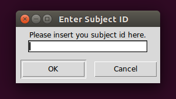
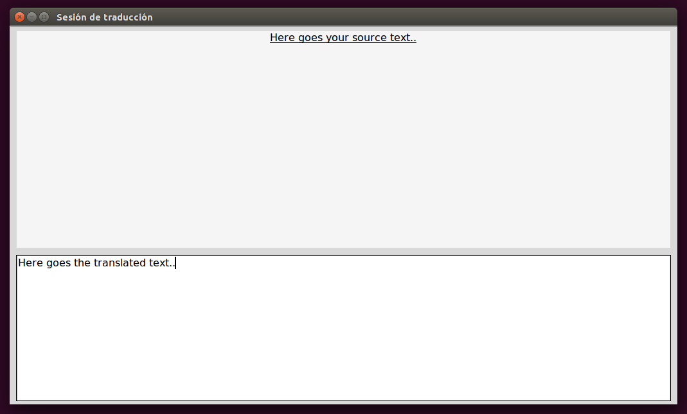

# ResearchLogger
Extension of PyKeylogger, an open-source Python key-logger. Intended for all kinds of writing processes studies.


## Features:
- Portable
- Generates a log with mouse and keyboard activity.
- Takes fixed timed screen-shots.
- Takes small pictures of the area around click strokes.


## Dependencies:

### Linux
- validate [sudo pip install validate]
- Xlib [sudo apt-get install python-xlib]
- Python Image Library (PIL) [sudo apt-get install python-pil]
- gtk [sudo apt-get install python-gtk2]


## How to use:

### Without GUI:
- To start the key-logger:
````
python ResearchLogger.py
````
- To start the translation window (without the key-logger):
````
python ResearchLoggerInterface.py -d YOUR_CHOSEN_PATH
````
where YOUR_CHOSEN_PATH is the directory where you would like to save the target text (the output). If you do not specify a directory:
````
python ResearchLoggerInterface.py
````
by default it will save the file on the current directory.
- To stop the key-logger, you should press the combo:
````
CTRL left + CTRL right + F12
````
The default password is empty. Then go to "Actions" > "Quit"

### With GUI:
- To start the GUI run:
````
python ResearchLoggerInterface.py
````
- Enter the subject name.

- Select the text of the experiment you are running.

- Then the window opens and, once the subject is finished with the task, the window can be closed by using the X button.


## Output:
ResearchLogger generates four folders:
- **click_images**: Contains images of every "click" made during the logging session.
- **detailed_log**: Contains a registry of every "keystroke" that occurred during the logging session.
- **system_log**: Contains a detailed registry of system errors that may have occurred as well as info on the system activity.
- **timed_screenshots**: Every some fixed period of time, the program will take a screen-shot and save it to this folder.

When using the GUI, a file is generated with:
- The start and end time of the session.
- The final product that the subject was working on.

**Important**: Please note that you need to run the key-logger separately and that the GUI does not automatically start the key-logger.


## Supported platforms:
- Linux (Ubuntu / Debian).
- Windows XP/7